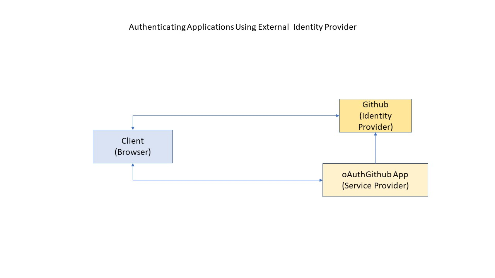
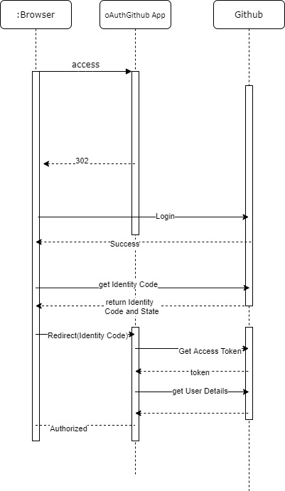

# oAuthGithub

There are many projects that demonstrates  how to integrate Spring Boot with Github. This project focusses on under the hood what is happening . 

# Needs

1. The application needs an Authentication Mechanism provided by external vendor.
2. The Application does not want to keep up the usernames and passwords.
3. The Application can keep up the application specific user data in its own database . After Authentication , application can map those Identities to Users in its own Repository.
4. Github is used as a proof of concept to do the Autentication. (Github plays Authentication/Identity Provider Role)

# Architecture :

There are three components involved

1. Browser
2. The Application (oAuthGithub ) which is the Service Provider
3. Github the Authentication Provider

# Sequence Diagram : 

# Observation: 

1. Spring Boot Framework provides all integration capabilities. Only Client Id and clientSecret are configured.
